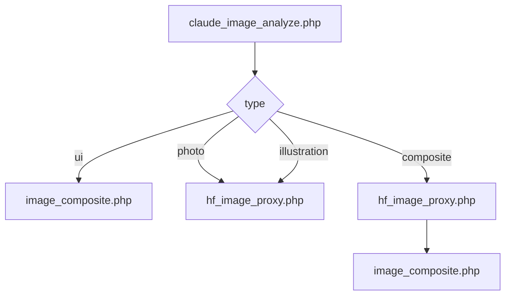

# Site Reverse CMS

参照サイトの URL から HTML を取得し、汎用サイト解析で編集可能な構造を JSON 化。顧客向け文言を流し込み、同じ構成のサイトを静的 HTML として再生成する PHP 製 MVP。

**アプリバージョン:** `1.4.0`（`index.php` の `APP_VERSION` と同期。**ビルド**は Git 短ハッシュ、取得できない環境では主要ソースの更新日 Ymd）

**ドキュメント:** [開発経緯・成果とゼロからの構築手順（PROJECT_HISTORY_AND_SETUP.html）](docs/PROJECT_HISTORY_AND_SETUP.html)（`/lp_reverse_cms/docs/` でも同じページが開きます）  
　※ ソースの Markdown は [PROJECT_HISTORY_AND_SETUP.md](docs/PROJECT_HISTORY_AND_SETUP.md)

**公式リポジトリ:** [BinaryTraffic/lp-next](https://github.com/BinaryTraffic/lp-next)（クローン URL は末尾 `.git` 可）

**v1.2.0 以降（S2 先立ち）:** AI 画像候補出し（スプリント S2）の前に、**プロンプトコレクション管理**（プロンプト文の蓄積・版管理・意図・業種との紐づけ）を補う方針。理由と全体像は [プロジェクトジャーナル（JOURNAL.md）](../JOURNAL.md) を参照。

---

## Git

初回クローン:

```bash
git clone https://github.com/BinaryTraffic/lp-next.git
cd lp-next
# DocumentRoot = lp_reverse_cms のみの例（リポジトリルートがカレント）
php -S localhost:8080 -t lp_reverse_cms

# DocumentRoot = リポジトリルートの例（入口は / 、管理画面は /lp_reverse_cms/）
# php -S localhost:8080
```

既にローカルで作業している場合のリモート設定例:

```text
git remote add origin https://github.com/BinaryTraffic/lp-next.git
git branch -M main
git push -u origin main
```

### 共同作業（別マシン・別 Cursor）

- 作業前: `git pull origin main`
- リモートと同じコミットか確認: `git fetch origin` のあと、`git rev-parse HEAD` と `git ls-remote origin refs/heads/main` のハッシュ先頭が一致するか見る（例: `4895729`）
- 接続先確認: `git remote -v` → `BinaryTraffic/lp-next.git`

---

## 技術スタック

| 項目 | 内容 |
|------|------|
| 言語 | PHP 8.x（`declare(strict_types=1)`） |
| HTML 取得 | cURL（`LpFetcher`） |
| HTML 解析 | `DOMDocument` / `DOMXPath`（`LpAnalyzer`） |
| 構造保存 | JSON（`data/lp_structure.json` 等） |
| テンプレート | 素の PHP（Blade 等は不使用） |
| 管理 UI | Bootstrap 5 + 独自 CSS/JS |

---

## ディレクトリ構成（現状）

```text
lp_reverse_cms/
├── index.php              # 管理画面（3 ステップ）
├── preview.php            # 生成 LP のプレビュー（デバイス切替）
├── export.php             # output/index.html をダウンロード
├── README.md              # 本ファイル
├── .htaccess
│
├── lib/
│   ├── LpFetcher.php      # cURL で HTML 取得・文字コード変換
│   ├── LpUrlContext.php   # `<base href>` 対応の相対 URL 解決
│   ├── LpAssetDownloader.php  # CSS / 画像 / JS / フォント取得、output/assets 保存
│   ├── LpAssetAudit.php   # 参照 URL 収集・未取得一覧（debug 用）
│   ├── LpOutputAudit.php  # 生成 HTML の未置換 URL スキャン
│   ├── LpAnalyzer.php     # セクション・要素抽出、data-lp-id 付与
│   ├── LpMapper.php       # セクション分類・UI メタデータ
│   ├── LpGenerator.php    # 構造 + 顧客データ → HTML、asset_map 適用
│   └── env_load.php       # `.env` 読込（OpenAI 中継などで使用）
│
├── store/
│   ├── fetch_lp.php       # POST: URL → HTML 取得 + アセット DL
│   ├── analyze_lp.php     # POST: fetched.html → lp_structure.json
│   ├── save_client.php    # POST: client_data.json 保存
│   ├── generate_lp.php    # POST: output/index.html 生成 + output_unreplaced.json
│   ├── get_lp_structure.php # GET: data/lp_structure.json をそのまま返す（data/ 直リンク 403 回避用）
│   ├── openai_image_proxy.php # POST: OpenAI Images API 中継（lp_ai_image_review.html 用）
│   ├── image_composite.php    # POST: 背景＋テキスト座標（%）合成 JPEG → output/ai_images/
│   ├── hf_image_proxy.php     # POST: HF Inference 画像生成 → output/ai_images/hf_*（Claude type 連携）
│   ├── env_keys_status.php    # GET: lp_reverse_cms/.env 読込可否・主要キー有無（秘密は返さない）
│   ├── ai_image_proxy_status.php # GET: サーバー側キー有無・クライアントキー許可（UI 用 JSON）
│   └── debug.php          # GET: 未取得・未置換・fetch 失敗などの JSON
│
├── template/
│   ├── editPage.php       # 編集フォーム
│   └── generated_lp.php   # プレビュー用ラッパ（参考）
│
├── assets/                # 管理画面用
│   ├── css/index.css
│   └── js/index.js
│
├── data/                  # 作業データ（.htaccess で *.json 直アクセス制限 → 403。参照は get_lp_structure.php）
│   ├── source.html        # 取得直後の HTML
│   ├── fetched.html       # 解析入力（通常は source と同一）
│   ├── source_url.txt     # 最終リダイレクト後 URL
│   ├── asset_map.json     # 絶対 URL → ローカル相対パス
│   ├── fetch_failures.json    # HTTP 取得失敗 URL 一覧
│   ├── output_unreplaced.json # 生成 HTML に残った外部 URL スキャン結果
│   ├── lp_structure.json
│   └── client_data.json
│
└── output/                # 生成物
    ├── index.html
    └── assets/
        ├── css/
        ├── img/
        ├── js/
        └── fonts/
```

**OpenAI 中継:** `store/openai_image_proxy.php` は `OPENAI_API_KEY` をサーバー側から優先します。既定の定義場所は **`lp_reverse_cms/.env`**（例: `/home/lp-next/current/lp_reverse_cms/.env`）。`lib/env_load.php` が読み込みます。手順は `.env.example` を参照。`OPENAI_DENY_CLIENT_KEY=1` にすると本文の `api_key` を拒否します。**鍵の有無だけ**は `store/env_keys_status.php`（GET・秘密は返さない）で確認できます。

**画像合成:** `store/image_composite.php` は `background_url`（`/output/...` のみ）と `texts`（0〜1 の `x_pct` 等）を受け取り、`output/ai_images/composed_<uniqid>.jpg` を書き出します。描画は **GD + FreeType** を優先し、不可時は **Imagick**。フォントは既定で `/usr/share/fonts/opentype/noto/NotoSansCJK-{Regular,Bold}.ttc`（GD では `.ttc:index` を自動解決）または `.env` の `IMAGE_COMPOSITE_FONT*`。

**HF 画像生成:** `store/hf_image_proxy.php` は `HUGGINGFACE_API_TOKEN`（または `HF_TOKEN`）で [Inference API](https://huggingface.co/docs/api-inference) に接続し、`HF_IMAGE_MODEL`（既定 `black-forest-labs/FLUX.1-schnell`）で text-to-image します。POST の `mode`（`photo` / `illustration` / `composite` / `ui`）に応じてプロンプト接頭辞を切り替え、`prompt` と Claude の `background_description` を合成します。成功時 `{ "url": "/output/ai_images/hf_….png|jpg" }`。

**Claude Vision → 置換パイプライン（想定フロー）:**



- **ui** … 元がボタン等・テキスト座標のみ再現 → 背景はユーザー指定または単色扱いで `image_composite.php` のみでも可。
- **photo / illustration** … `hf_image_proxy.php`（`mode` 一致、`illustration_style` は illustration 時に反映）。
- **composite** … まず `hf_image_proxy.php` で**文字なし背景**、続けて Claude の `texts` を `image_composite.php` に渡す。

**AI 画像パイプライン（実験・テスト）:** `store/lp_ai_image_pipeline.php` が同一セッションの `output/ws_*` 内画像を Vision 解析し、`photo` / `illustration` は HF で差し替え画像 URL を返し、`ui` / `composite` は HF 背景＋`image_composite_post_body`（2 段目は `image_composite.php` へ POST）を返します。`replacement.mode === placeholder`・未対応タイプ・HF 失敗時は **`lib/placeholder_png.php`** でサイズ表記付き PNG を `ai_images/` に保存します。ブラウザからは **`lp_ai_image_pipeline_test.html`**（管理画面と同じオリジンで開く）を使用。`claude_image_analyze.php` は **`image_data`**（base64）・**`industry`**・応答 **`replacement`** / **`texts.lines`** に対応（実装は **`lib/claude_vision_analyze.php`**）。

---

## 起動方法（開発）

PHP 組み込みサーバーの例（XAMPP の PHP を想定）:

```powershell
C:\xampp\php\php.exe -S localhost:8080 -t "C:\path\to\lp_reverse_cms"
```

ブラウザで **http://localhost:8080** を開く（`index.php` をファイルから直接開かないこと）。

---

## 利用フロー

1. **Step 1 — 解析する**  
   - `store/fetch_lp.php` が HTML を取得し `data/source.html` 等に保存。  
   - `LpAssetDownloader` が `<link rel="stylesheet">`、`` / `srcset` / 遅延読み込み属性、`<script src>` 等を `output/assets/` に保存し、`data/asset_map.json` を更新。  
   - 続けて `analyze_lp.php` が `fetched.html` を解析し `lp_structure.json` を生成。

2. **Step 2 — 編集**  
   - セクション別にテキスト・画像 URL・リンクを編集。  
   - 「保存＆サイト生成」で `save_client.php` → `generate_lp.php`。

3. **Step 3 — 確認**  
   - プレビュー / エクスポート。  
   - ナビの **🐛** または `store/debug.php` でアセット件数・未置換 URL の目安を確認可能。

---

## 生成 HTML とアセット

- 最終 HTML は `output/index.html`。  
- CSS / 画像 / JS は `output/assets/` 配下を相対参照（例: `assets/css/common.css`）。  
- `LpGenerator` は `asset_map.json` に基づき、生成後の HTML 内の絶対 URL をローカルパスへ置換する。  
- Windows 環境で過去に混入し得た `https://host\path` や `host%5C` 形式は、生成時に正規化してから置換する（v1.1.1）。

---

## 既知の注意点

- アセットの多いサイトは **取得に数十秒** かかることがある。  
- 動的に挿入されるリソースのみのサイトは、静的取得では取りこぼしがある。  
- 本番運用では Apache 等のドキュメントルートに配置し、`data/` の保護を維持すること。
- クローン直後など **`data/` / `output/` の所有者**が、Web・PHP 実行ユーザー（例: `www-data`）と**ずれている**と解析が**書き込めない**（**v1.1.11** 以降は取得段階で**明示**）。[`ENVIRONMENT_AND_OPERATIONS.md`](../ENVIRONMENT_AND_OPERATIONS.md) の**留意点**を参照。
- **アセット URL — 日本語パスと `%` エンコードの表記ゆれ:** 同一ファイルでも URL の書き方が違うと `asset_map` 置換が欠けることがある。正規化・別表記の登録・生成時のエイリアス展開。**コミット `f462a95`**（詳細は [PROJECT_HISTORY_AND_SETUP.md](docs/PROJECT_HISTORY_AND_SETUP.md) §2.8）。
- **アセット URL — JS テンプレート残骸（例 `…/${item.i}`）:** HTTP では取得できないが、診断の「未取得」に載ることがあった。**コミット `d912b2f`**（同上 §2.8）。

**運用の詳細**（`data/` 非公開、HTTPS、タイムアウト、`git pull` 後の `data`/`output` など）: リポジトリルートの [ENVIRONMENT_AND_OPERATIONS.md](../ENVIRONMENT_AND_OPERATIONS.md) を参照。

---

## バージョン履歴（概要）

| 版 | 内容 |
|----|------|
| 1.0.x | 初版 MVP（HTML のみ中心） |
| 1.1.0 | アセット DL、診断 UI、head の link 全属性保持 |
| 1.1.1 | Windows 起因の URL 不正（`\` / `%5C`）修正、`LpAssetDownloader` の相対 URL 解決修正 |
| 1.1.2 | `<base href>` 対応、CSS `url()` からフォント等も取得、`debug.php` に未取得・未置換一覧、生成後スキャン |
| 1.1.3 | `debug` の map 件数修正（`assets/` パス）、未取得判定の `/img`↔`/images`・Google Fonts ホスト差・ローカル実ファイル照合、favicon 取得、preconnect ノイズ除去 |
| 1.1.4 | `applyAssetMap` を絶対 URL 優先の二段置換に整理（相対キーが長い `href` 内を先に壊す問題の防止）、map 展開ループの代入バグ修正 |
| 1.1.5 | `//` マップキーを `https://` 内へ誤マッチしない置換に変更、相対キーは引用符付き href/src 等と srcset のみ置換（`assets/assets/...` 二重化の防止）、https から `//` への重複展開を廃止 |
| 1.1.6 | 未置換スキャンで HTML コメントを除外（コメント内 URL の誤検知防止）、`debug.php` 表示時に `output/index.html` を再スキャンして `output_unreplaced.json` を更新 |
| 1.1.7 | `LpAnalyzer`: `<picture>` 内の `img` を走査して編集対象化（従来は `picture` がコンテナ外でヒーロー背景相当の画像がフォームに出ない問題）、`class` に `bg` を含む画像はラベルを「背景画像」に、`source` の `srcset` も absolutize |
| 1.1.8 | `LpAnalyzer`: 誤った `</source>` 位置などで `img` が `source` の子になる DOM でも拾えるよう、`source` をコンテナとして再帰；`docs/PROJECT_HISTORY_AND_SETUP.md`（経緯・ゼロからの構築手順）追加 |
| 1.1.9 | リポジトリルート用 `index.html`、DocumentRoot をルート／`lp_reverse_cms` の 2 通りで説明（URL から `/lp_reverse_cms/` へ辿る手順）、各 README・SETUP のパス追記 |
| 1.1.10 | ルートに [ENVIRONMENT_AND_OPERATIONS.md](../ENVIRONMENT_AND_OPERATIONS.md) を追加（環境・セキュリティ・運用・トラブル）。ルート `README` / `index.html`、各手順書から辿る |
| 1.1.11 | `store/fetch_lp.php`: `data/` への `file_put_contents` 失敗を検出し、書き込み不可時は明確にエラーを返す。Git タグ **`v1.1.11-stable`** ＆ [ルート README](../README.md) の**安定版（フィックス版）**で本番例（`lp-next.jitan.app`）のラインを指し示し |
| 1.2.0 | アセット解像度: CSS 内 `@import` の再帰取得とローカル差し替え、CSS `url()` の除外強化・フラグメント除去、HTML 側相対 URL を `LpUrlContext` に一本化、`srcset` トークン解析の改善、`data-src` 明示、**`store/debug.php`** に `output_css_diagnostics`（保存済み CSS の外部 `url` / `@import` 残存） |
| 1.2.1 | セッション別ワークスペース（`lib/LpWorkspace.php`、`data/ws_*` / `output/ws_*`）。**`preview.php`** スプラッシュ：`readyState === 'complete'` ＋ **`fonts.ready`**（タイムアウト付き）と描画猶予で白画面を低減。Step 3 診断を **`debug.php`** 応答形に合わせる。インポート後の業種推定・AI テキスト置換の単一路線化（`index.php` / `editPage.php` / `assets/js/index.js`）など。 |
| 1.4.0 | UI を「サイト」「汎用サイト解析」に統一。**ビルド表示:** `APP_BUILD` は Git 短ハッシュ（取得できない環境では主要ソース更新日の Ymd）。 |
| 1.3.0 | **マルチユーザー／clone:** `clone_id`（`data/clone_id.txt`）、`LpCloneContext`、`sites/<clone_id>/custom_images/` への手動画像。**エクスポート:** `LpExportBundle` で ZIP 既定、`export.php?type=html` で単一 HTML。**AI テキスト:** 要素数上限のトグルと `no_element_limit`（`store/text_replace.php`）。プレビュー復帰時の二重自動置換防止（`from_preview`）。**画像メモ:** 生成 HTML の `data-lp-image-text-memo` とパイプライン連携（`lp_image_memo_merge` / `lp_ai_image_pipeline` 等）。**Step1 プロフィール:** `lp_project_profile.json`（ZipCloud・SNS 等）、`?step=2` で編集再開。UI: 手動画像差し替えモーダル、`publicUrlFromApiPath` の `document.baseURI` 対応。詳細レポートは [current/JOURNAL.md](../JOURNAL.md#v130-要件と実装状況レポート) を参照。 |

---

*この README はリポジトリ現状に合わせて整備されています。更新日はリポジトリの最終コミットを参照してください。*
